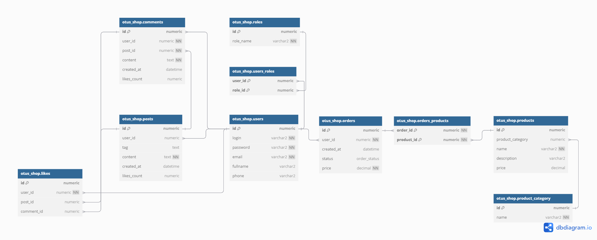

# OTUS_SHOP

Наименование схемы OTUS_SHOP. Реализует модель онлайн-магазина с дополнительной возможностью создания публикаций и комментарий к ним.

**Таблицы**:
1) OTUS_SHOP.USERS - таблица "Пользователи". Реализует сущность "Пользователь";
2) OTUS_SHOP.PRODUCTS - таблица "Публикации". Реализует сущность "Публикация";
3) OTUS_SHOP.ORDERS - таблица "Заказы". Реализует сущность "Заказ";
4) OTUS_SHOP.POSTS - таблица "Публикации". Реализует сущность "Публикация";
5) OTUS_SHOP.COMMENTS; - таблица "Комментарии". Реализует сущность "Комментарий"
6) OTUS_SHOP.PRODUCT_CATEGORY - таблица "Категория продукта". Реализует сущность "Категория продуктов";
7) OTUS_SHOP.LIKES - таблица "Отметки "Нравится"". Реализует сущность "Отметка "Нравится"";
8) OTUS_SHOP.ROLES - таблица "Роли". Реализует сущность "Роль";
9) OTUS_SHOP.USERS_ROLES - таблица "Роли пользователей". Реализует связь многие-ко-многим для сущностей "Пользователь" и "Роль";
10) OTUS_SHOP.ORDERS_PRODUCTS - таблица "Продукты заказа". Реализует связь многие-ко-многим для сущностей "Заказ" и "Продукт".

**Перечисления**:
1) OTUS_SHOP.ORDER_STATUS - перечисление "Статус заказа": "Создан", "Обработан", "Исполнен", "Удален"

**Индексы**:
1) POST_LIKES_IDX - индекс по столбцу "POST_ID" таблицы "OTUS_SHOP.LIKES";
2) COMMENT_LIKES_IDX - индекс по столбцу "COMMENT_ID" таблицы "OTUS_SHOP.LIKES";
3) PRODUCT_CATEGORY_IDX - индекс по столбцу "PRODUCT_CATEGORY" таблицы "OTUS_SHOP.PRODUCTS". 

**Ограничения**:
1) Таблица USERS: поля LOGIN, EMAIL уникальны и не пусты для таблицы, поскольку пользователи должны быть уникальны в разрезе логинов и электронных почт, а также нельзя, чтобы пользователь не указал логин и эл. почту;
2) Таблица ROLES: поле ROLE_NAME в таблице уникально, поскольку не может быть одинаковых ролей;
3) Таблица COMMENTS: поля USER_ID, POST_ID, CONTENT не пусты для таблицы, поскольку нельзя оставлять пустые комментарии, а также комментарий должен принадлежать какому-либо пользователю и к какой-либо публикации. Поля USER_ID, POST_ID - внешние ключи на USERS и POSTS соответственно;
4) Таблица POSTS: поле CONTENT не пусто для таблицы, поскольку нельзя создавать "пустые" публикации. Поле USER_ID - внешний ключ на таблицу USERS;
5) Таблица PRODUCTS: поле NAME для таблицы  не пустое, поскольку наименование продукта не может быть пустым. Поле PRODUCT_CATEGORY - внешний ключ на таблицу PRODUCT_CATEGORY;
6) Таблица PRODUCT_CATEGORY: поле NAME в таблице не пусто и уникально, поскольку наименование категории не может быть пустым и повторяться;
7) Таблица ORDERS: поле USER_ID - внешний ключ на таблицу USERS. Поле PRICE не может быть пустым и должно быть > 0;
8) Таблица ORDERS_PRODUCTS: поля ORDER_ID и PRODUCT_ID - внешние ключи на таблицы ORDERS и PRODUCTS соответственно;
9) Таблица LIKES: поля USER_ID, POST_ID, COMMENT_ID - внешние ключи на таблицы USERS, POSTS и COMMENTS соответственно.

**Индексы**:
1) Таблица LIKES:
	1) LIKES_POST_LIKES_IDX - индекс на поле POST_ID с **высокой кардинальностью**, для быстрого отбора отметок "Нравится" на публикации (**SELECT * FROM LIKES WHERE POST_ID = ?**),
	2) LIKES_COMMENT_LIKES_IDX - индекс на поле COMMENT_ID с **высокой кардинальностью**, для быстрого отбора отметок "Нравится" на комментарии (**SELECT * FROM LIKES WHERE POST_ID = ?**);
2) Таблица ORDERS:
	1) ORDERS_USER_ID_IDX - индекс на поле USER_ID с **высокой кардинальностью**, для быстрого поиска заказов пользователя (**SELECT * FROM ORDERS WHERE USER_ID = ?**)
3) Таблица PRODUCTS:
	1) PRODUCTS_PRODUCT_NAME_IDX - индекс на поле NAME **с высокой кардинальностью**, для быстрого поиска и фильтрации продуктов (**SELECT * FROM PRODUCTS WHERE NAME LIKE '%?%'**)